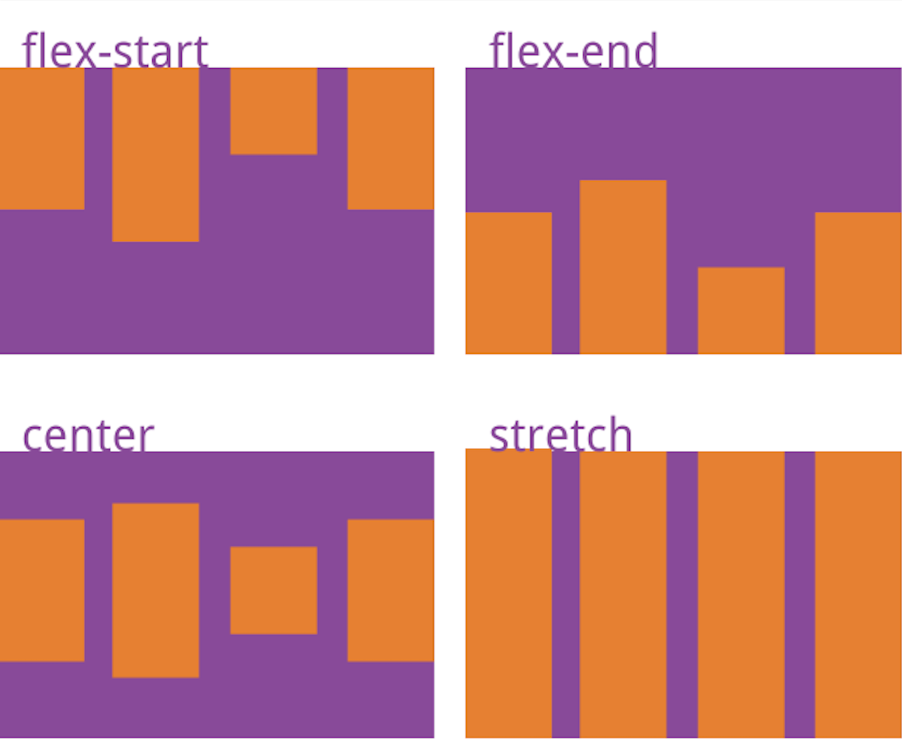

# React Native - Quick Start

----

## Build a simple Todo APP

 - 多么Simple?
 - 老Simple了。

----

## Before we start - Component LifeCycle


----
* getDefaultProps
	```text
    Called only once when inited.
    ```
* componentWillMount
    ```text
    Called only once before first `render`.
    ```
* componentDidMount
	```text
    Called only once after first `render`.
    ```
* componentWillReceiveProps
	```text
    Will receive props. Useful along with `redux`
    ```
* shouldComponentUpdate
	```text
    Prevent over draw.
    ```
* componentWillUnmount
----

## Mounting

| React Native       | iOS                     | Android                 |
| ------------------ | ----------------------- | ----------------------- |
| constructor        | init*                   | constructor / onCreate  |
| componentWillMount | viewWillAppear          | onStart                 |
| componentDidMount  | viewDidAppear           | onResume                |
| render             | drawInRect / other code | onDraw / onCreateView   |
| componentWillUnmount | viewWillDisappear     | onPause / onStop / onDestroy  |

----

## Updating

* componentWillReceiveProps()
* shouldComponentUpdate()
* componentWillUpdate()
* render()
* componentDidUpdate()


[Reference](https://facebook.github.io/react/docs/react-component.html)

----
## Unmounting

* componentWillUnmount()
----

## Create Project and add dependencies.

* react-native init [*project*]
* cd [*project*]
* yarn start
* react-native run-ios

----

## Create Basic UI

* Todo list
* Add todo

----

## Using `ListView`

* dataSource
	* rowHasChanged: determine re-render row or not. [Reference](https://github.com/facebook/react-native/blob/master/Libraries/Lists/ListView/ListView.js#L81)
* renderRow


| React Native | iOS                   | Android                             |
| ------------ | --------------------- | ----------------------------------- |
| dataSource   | dataSource            | adapter                             |
| renderRow    | cellForRowAtIndexPath | onCreate/BindViewHolder |

* Update list
* *Reuse issues*

----

### ListView Callbacks
* onEndReached
* renderFooter
* renderHeader
* renderSectionHeader
* renderSeperator

----

## Add a button

* TouchableOpacity

    There is no such widget as 'Button' or 'UIButton'. 
    Using `Touchable*` combining with `Text` or `Image` as replacement.
    
    
* onPress

	Callback when pressed.
----

## Using flexbox
* flex
* flexDirection
	```text
    Direction on `primary axis`. 
    Default to 'column' - vertical layout
    ```
    
* justifyContent
* alignItems

----
## *justifyContent*

```text
Distribution of children along `primary axis`.
```
    
|     Value     |     Column direction     |      Row direction     |
| ------------- | ------------------------ | ---------------------- |
| flex-start    | align top                | align left             |
| center        | vertical center          | horizontal center      |
| flex-end      | align bottom             | align right            |
| space-around  | equal space in start & end on each component | * |
| space-between | equal space between each component | * |
    

----

## 有图有真相
* flexDirection: 'row'


----

## *alignItems*
```text
A component's style determines the alignment of children
along the secondary axis
```
|     Value     |     Column direction     |      Row direction     |
| ------------- | ------------------------ | ---------------------- |
| flex-start    | align left               | align top              |
| center        | horizontal center        | vertical center        |
| flex-end      | align right              | align bottom           |
| stretch       | equal width              | equal height           |

----

## 有图有真相
* flexDirection: 'row'


----
## Integrate Redux

* Add dependencies
* redux
* react-redux
* redux-persistent
* redux-thunk
* Add `actions`, `reducers` and `store`

----

## Using a third party lib

* Add JS dependency
* Modify iOS project
* Modify Android project

----
## Add reference to widget
	
* ref={'name'}
* ref={(view) => {this.view = view}}

----

## Navigations

* react-native-navigation
* react-navigation
* [Glow] NativeNavigator
	* Push / present *new* view controller or activity

----

## Deal with keyboard

* KeyboardAvoidingView
* *Keyboard* module

----
## Android Support

* Native calls
* Backkey
* Navigation
* Performance

----

## Pitfalls

* ListView reusing issue
* Image
* Image cache
* Modal present [issue](https://github.com/facebook/react-native/issues/10471)

----

## How we ride at Glow Community

* Common Widgets - Images, Texts, Buttons and more - *C9XXX*
* Navigations - *NativeNavigator*
* Modal dialogs and Alerts - *C9Dialog*
* Network - *APIClient*
* Native modules - *AppInfo*, *ForumBridge*, etc
* PubSub 

----
## Q&A


----


